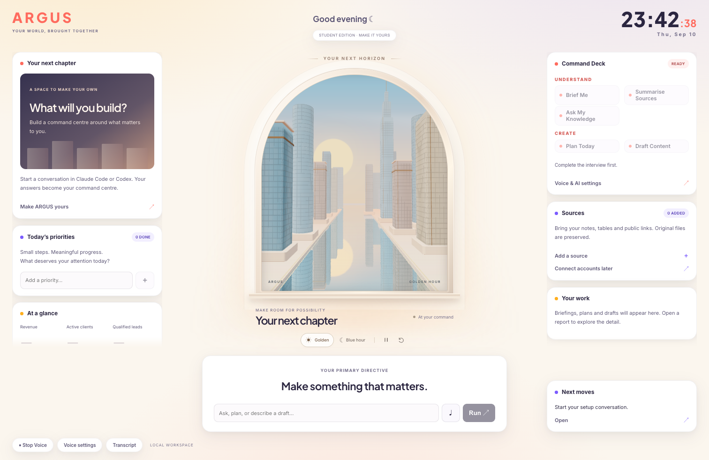

# ARGUS

### Your world, brought together.

A personal command centre you make your own through conversation. The finished interface includes a dreamy 3D city, warm DAYBREAK colours, responsive panels, reports, tasks and free voice output. Use it for your business, creative work, studies or personal projects.



## Start here

1. **Download:** use GitHub's **Code → Download ZIP**, then unzip the folder. Or clone this repository.
2. **Open the folder in Claude Code or Codex.** You need your own supported account. Install Node.js **22.13 or later** if it is not already available.
3. **Paste this prompt:**

> Make ARGUS my own. Ask me questions one at a time, understand what I want to build, and customise it using my information. Keep the existing design unless I ask you to change it.

Your assistant reads the included onboarding guide, asks about your goals and sources, confirms the brief, and builds your version. The supplied look and feel stays intact unless you ask to change it. Your answers, information and generated reports stay outside Git.

## Preview before personalising

From the project folder:

```sh
npm ci
npm run setup
npm start
```

Open **http://127.0.0.1:3117**. Keep the terminal open while using ARGUS. The first start builds the application. Use `npm run stop` from another terminal or Ctrl+C to stop the managed services. There are no `.env` files or API keys required for the basic console and system speech.

macOS, Windows and Linux use the same npm commands. Windows students can use PowerShell. Background AI commands need `claude` or `codex` installed on PATH and signed in separately; having a desktop assistant open is not sufficient. Run `npm run doctor` to see what is available.

## What you get

- **Your ARGUS design:** 3D city opening, golden/blue hour, pause and replay, illustration fallback, DAYBREAK panels and typography, responsive layout and keyboard controls.
- **An adaptable console:** metrics, tasks, notes, reports, sources and command panels, with business, creator and learning starting configurations.
- **Your knowledge:** import Markdown, text, CSV, JSON, text PDFs and public HTML pages. Preserve originals, source IDs and timestamps. Other attachments are retained with an extraction-needed label.
- **Five working AI workflows:** Brief Me, Plan Today, Summarise Sources, Ask My Knowledge and Draft Content, using your selected CLI and imported source excerpts.
- **Free voice output:** choose and preview available device voices. Stop speech with the button or Escape. Your typed requests are always available.
- **Optional local voice:** Kokoro male/female voices and faster-whisper microphone input.

Data-backed workflows become available after the interview, provider selection and runner startup. Private account connections are additional integrations, not preconnected services. No personal advertising, sales, email or calendar accounts are included.

## Add your information

Use **Sources → Add a source**, or ask your assistant to run:

```sh
npm run import -- --file "path/to/your-notes.md"
npm run import -- --folder "path/to/a-folder-you-selected"
npm run import -- --url "https://example.com/public-page"
```

The importer reads only selected locations, skips hidden files, known credential filenames and symlinks, and preserves originals. Limits: 10 MB per file/page, 100 files per folder import, 200 pages per PDF. Scanned PDFs require a later OCR integration. CSV metrics require confirmed units, column meanings and reporting periods; an imported table alone is not a verified metric.

Obsidian is optional. The interview can create an `ARGUS` area inside your selected vault without replacing existing notes. Configuration details: [Configuration guide](docs/configuration.md).

## Optional male/female voice and microphone

Install Python **3.10–3.12** (3.12 recommended), then:

```sh
npm run voice:setup
npm run stop
npm start
```

In **Voice settings**, choose Kokoro, preview Heart or Emma (female), or Michael or George (male), then save. If Python has a nonstandard location, use `npm run voice:setup -- --python "path/to/python"`.

The installer downloads verified Kokoro models and an English transcription model (approximately 450 MB total plus dependencies). CPU operation is supported. Hold Space outside text fields, or click the microphone control, to record. Review the transcript and press Run. Speech also works without a microphone.

Device voices vary by operating system. Some system voices may use the device vendor's online service; Kokoro runs locally after download. No cloned voices or paid voice API are included.

## Useful prompts after setup

- “Turn this into a command centre for my design studio. Keep the existing design.”
- “Use these lesson notes to build my study dashboard.”
- “Add my weekly goals and a panel for unfinished projects.”
- “Import this CSV and ask me to confirm its metric definitions.”
- “Draft a post based only on the claims supported by my sources.”

## What runs where

Your files and reports live on your computer. AI commands send selected source excerpts to your chosen provider using your own account and usage limits. Local storage does **not** make AI processing offline. The console and optional voice service bind only to localhost; this starter is not configured for public hosting.

The starter does not send email, publish content, change ad accounts or automatically connect private services. Ask your assistant to implement the specific integrations you need using your own authorisation.

## Development and checks

```sh
npm start -- --dev
npm test
npm run typecheck
npm run build
npm run release:check
```

The command centre uses Next.js, React and Three.js. It retains the original ARGUS city and design styles. Fonts are packaged locally. See [Architecture](docs/architecture.md), [Troubleshooting](docs/troubleshooting.md) and [Validation](docs/validation.md).

## Licence

MIT. You may modify, share and commercially use your version while retaining the licence notice. Third-party components retain their own licences; see [Third-party notices](THIRD_PARTY_NOTICES.md).
